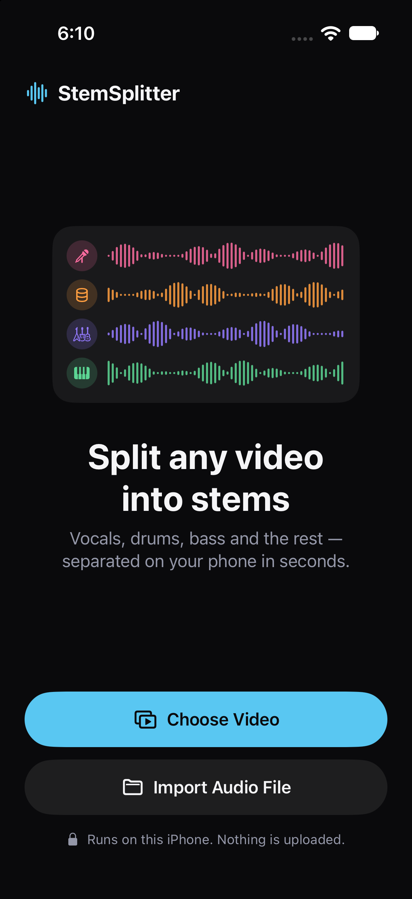
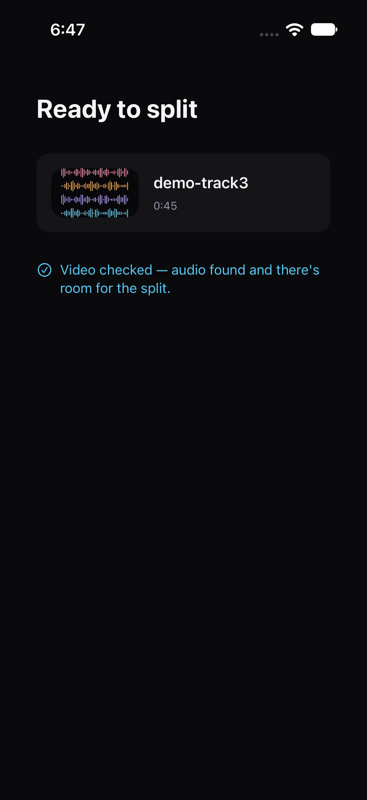
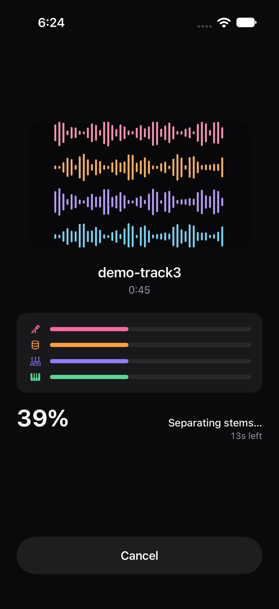
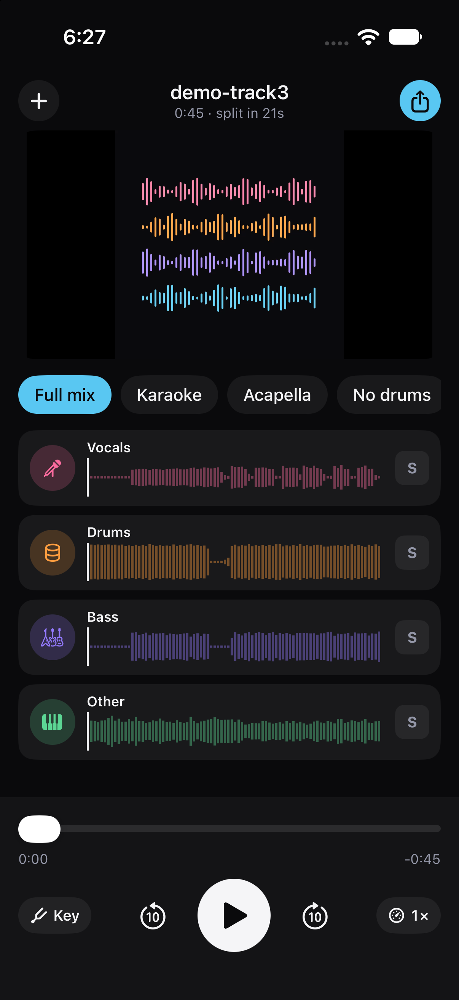

# StemSplitter

On-device AI stem splitter for iOS. Pick any video from your camera roll (or an audio
file), split it into **vocals / drums / bass / other** with Meta's
[htdemucs](https://github.com/adefossez/demucs) model, remix the stems with a
mute/solo/pitch/speed mixer, and export the mix, a video with the new mix, or any
individual stem as 24-bit WAV — all through the share sheet.

No account. No upload. Nothing leaves your phone.

## Screenshots

| Pick from your library | Ready to split |
|:---:|:---:|
|  |  |
| **On-device separation** | **Mix, play, export** |
|  |  |

## Features

- **Video-native.** The camera roll is the library: pick a video, the audio track is
  extracted and resampled on device. Audio files import from the Files app too.
- **4-stem separation** (vocals, drums, bass, other) with htdemucs running on the GPU
  via Core ML.
- **Mixer** — mute/solo per stem, mix presets, pitch shift, speed — with live playback.
- **Export** the mix, any stem as 44.1 kHz / 24-bit WAV, or the original video with the
  new mix — via the standard share sheet.
- **Fully offline.** No network stack, no analytics, no third-party packages — only
  Apple frameworks and the bundled model.
- **Streaming engine.** Chunks flow through STFT → model → inverse STFT with
  overlap-add; peak memory stays under 400 MB on a 15-minute split. Instrumental is
  derived by complement subtraction so stems sum back to the source exactly.

## Requirements

- Xcode with the iOS 18 SDK
- iOS 18+ (device or simulator)
- The converted Core ML model (see below — not included in the repo)
- A free personal Apple Developer team is enough to run on your own device
  (7-day re-sign); TestFlight needs a paid membership

## Install (build from source)

```sh
git clone https://github.com/kristerssaulitis/stemsplitter.git
cd stemsplitter
open StemSplitter.xcodeproj
```

Select the **StemSplitter** scheme, pick a destination, and run.

**Device:** Signing & Capabilities → select your team, then Run. (A free personal team
works; the build re-signs for 7 days each time you re-run.)

**Simulator:** works out of the box but takes the CPU fallback path (the simulator has
no GPU-usable Neural Engine path for this model), so splits are much slower than on a
real device.

### The model (one-time setup)

`Models/` is gitignored — the app target expects `Models/htdemucs.mlpackage` at the
repo root (~120 MB, mixed fp16/fp32 precision) and will not build without it.

It is produced by converting Meta's htdemucs weights (MIT licensed) with
[coremltools](https://coremltools.readme.io/). The Core ML package wraps only the
network core — Core ML has no complex tensors, so the STFT/iSTFT pair around it runs
in Swift with vDSP. The conversion tooling is not in this repo yet; until it lands,
build the `mlpackage` from htdemucs yourself, or skip the app target and work with the
SwiftPM targets below (they build and test without the model).

### Command line

If `xcode-select` points at CommandLineTools on your machine, prefix with
`DEVELOPER_DIR`:

```sh
# Unit tests (model-dependent tests run when Models/htdemucs.mlmodelc exists)
/usr/bin/env DEVELOPER_DIR=/Applications/Xcode.app/Contents/Developer swift test

# App build verify (no signing needed)
/usr/bin/env DEVELOPER_DIR=/Applications/Xcode.app/Contents/Developer \
  xcodebuild -project StemSplitter.xcodeproj -scheme StemSplitter \
  -destination 'generic/platform=iOS Simulator' -derivedDataPath .build/dd \
  -quiet build CODE_SIGNING_ALLOWED=NO

# Benchmark harness (timings, memory profile, wall-clock linearity)
/usr/bin/env DEVELOPER_DIR=/Applications/Xcode.app/Contents/Developer swift run spike <corpus-dir>
```

## Use

1. **Pick.** The picker runs out of process — the app never asks for photo-library
   permission. Videos come from the camera roll; audio files via the Files importer.
   Sources up to 10 minutes.
2. **Split.** The engine streams chunks with live progress, per-stem peak meters, and
   a calibrated ETA. Cancel is instant and discards partial output.
3. **Mix.** Stem cards with mute/solo, mix presets, pitch, and speed, over a scrubbing
   waveform of the source.
4. **Export.** Share the mix, any stem (44.1 kHz / 24-bit WAV, RF64 beyond 4 GB), or
   the original video re-rendered with your mix — via the share sheet. Export is the
   only persistence: split outputs live in caches and are purged on next launch.

## Architecture

One-screen single-flow UI (picker → processing → result) on a model-agnostic streaming
engine:

```
StemSplitter.app
 UI LAYER (SwiftUI, Sources/StemUI)        ENGINE LAYER (Sources/StemCore)
 AppFlowView ──state──> ProcessingView     AudioExtractor (AVFoundation)
     │                    │                ├─ AVAssetReader audio-only decode
     │                    v                ├─ AVAudioConverter → 44.1 kHz
 PhotosPicker       ResultView            └─ no-audio / iCloud / offline errors
 (out-of-process,   ├─ source selector
  no library perms) ├─ stem cards +       StemEngine (actor, StemEngineProtocol)
                    │  long-press share    ├─ Chunker (size + overlap)
                    └─ ShareLink WAV       ├─ STFT/ISTFT (vDSP) + overlap-add
                                           ├─ DemucsEngine (CoreML, GPU→CPU fallback)
 SUPPORT (Sources/StemCore/Support)        ├─ complement: instrumental := source − vocals
 SplitStore     Caches/Splits/<uuid>/,     └─ WAVWriter (24-bit streaming, RF64 > 4 GB)
                purged on next launch
 ETACalibrator  persisted per-device,     PipelineEvent (Contracts/) — the ONE event
                keyed by model ID         surface engine → SwiftUI (progress, peaks,
 ModelStore     bundled .mlmodelc,        ETA, failure); exactly one terminal event.
                preloaded at launch
```

The `StemCore` / `StemUI` / `Spike` targets and the test suite are defined in
`Package.swift` (Swift 6, no third-party dependencies); `StemSplitter.xcodeproj` builds
the app target and compiles the model into the bundle.

Key invariants:

- Streaming pipeline, no whole-file float buffers; peak < 400 MB on a 15-minute split.
- Instrumental is derived by complement subtraction so stems sum to the source exactly.
- Output WAV is 44.1 kHz / 24-bit; mono sources upmix dual-mono; other sample rates
  pass an explicit resample stage.
- Cancel discards partial output; split WAVs live only in caches — share / Save to
  Files is the only persistence path.

## Privacy

On-device only: no cloud, no upload, no account, no network calls, no analytics, no
third-party packages. `PhotosPicker` runs out of process, so the app never requests
photo-library permission. See [`Release/privacy.html`](Release/privacy.html) and the
App Store runbook in [`Release/APP_STORE.md`](Release/APP_STORE.md) (privacy labels:
"no data collection"; `PrivacyInfo.xcprivacy` manifest included).

## License

App code: [MIT](LICENSE). The htdemucs model weights are MIT licensed by Meta — see
the [Demucs license](https://github.com/adefossez/demucs/blob/main/LICENSE.md).
